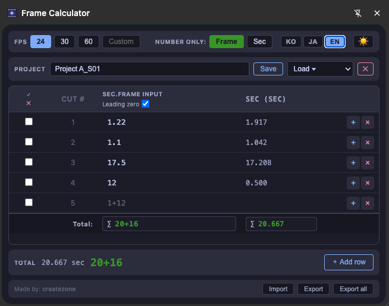

# Frame Calculator

[한국어](README.md) | [日本語](README.ja.md) | [English](README.en.md)

A Chrome extension for calculating frame/timecode durations in animation production.

Built to eliminate confusion caused by decimal notation in spreadsheet-based tools (`4.70` — is that 4 sec 7 frames, or 4 sec 70 frames?).

---

## Installation

1. Clone this repository or download as ZIP.
2. Open `chrome://extensions` in Chrome.
3. Enable **Developer mode** in the top-right corner.
4. Click **Load unpacked** and select the `output/` folder.

---

## Input Formats

Three formats are supported — all parsed as seconds + frames.

| Input | Meaning |
|-------|---------|
| `1+12` | 1 sec 12 frames |
| `1.12` | 1 sec 12 frames |
| `1 12` | 1 sec 12 frames |
| `.12` / `0.12` | 0 sec 12 frames (always treated as frames) |
| `36` | 36 frames or 36 seconds (depends on Number Only mode) |

- Frames exceeding the FPS value are automatically rolled over to seconds (e.g. `0+26` → `1+02` at 24fps)

---

## Features

### FPS
- **Preset buttons**: 24 / 30 / 60
- **Custom FPS**: any integer from 1 to 99

### Number Only Mode
Controls how a bare number (no separator) is interpreted.
- `Frame` mode: `5` → 0 sec 5 frames
- `Sec` mode: `5` → 5 sec 0 frames

### Table
- **Cut #**: auto-assigned row index
- **SEC.FRAME INPUT**: enter values in any supported format
- **SEC (sec)**: each row's value converted to decimal seconds
- **Total row (∑)**: cumulative total shown at the bottom in both `sec+frame` and decimal seconds
- **Leading zero**: toggle whether frames display with a leading zero (`5+03` ↔ `5+3`)

### Row Management
- **Add row**: button at the bottom, or press Enter on the last row
- **Insert row**: `+` button on each row inserts a new row below
- **Delete row**: `×` button on each row (shown when 2+ rows exist)
- **Enter key**: moves focus to the next row; adds a new row if on the last one

### Row Selection & Partial Sum
- **Checkbox**: select individual rows
- **Shift + click**: select a range
- **Select all / Deselect all**: buttons in the table header
- When rows are selected, the bottom summary switches to the **sum of selected rows only**

### Project Management
- **Save**: enter a name and click Save or press Enter
- **Load**: select a saved project from the dropdown
- **Delete**: `✕` button removes the current project
- **Auto-save**: saves automatically when focus leaves an input field

### Storage
- **Chrome Storage Sync** is used by default — projects sync automatically across devices via your Chrome account
- If a project exceeds the sync quota (8 KB per item), it falls back to **Chrome Storage Local** automatically
- A warning banner is shown above the table for any project that cannot be synced

### Import / Export
- **Export**: saves the current project as a JSON file
- **Export all**: saves all projects into a single JSON file
- **Import**: loads a JSON file and merges it (projects with the same name are overwritten)

### Display Settings
- **Dark / Light mode** toggle (🌙 / ☀️ button)
- **Language**: KO / JA / EN

---

## Made by

[createzone](https://jidae.com/)
