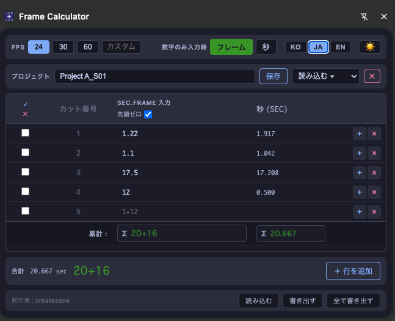

# フレーム計算機 (Frame Calculator)

[한국어](README.md) | [日本語](README.ja.md) | [English](README.en.md)

アニメーション制作向けのフレーム/タイムコード計算機 Chrome 拡張機能です。

従来のGoogleスプレッドシートベースのツールで発生していた小数点表記の混乱（`4.70` → 4秒7フレーム？4秒70フレーム？）を解消するために制作しました。

---

## インストール方法

1. このリポジトリをクローンするか、ZIPでダウンロードします。
2. Chromeブラウザで `chrome://extensions` を開きます。
3. 右上の **デベロッパーモード** を有効にします。
4. **パッケージ化されていない拡張機能を読み込む** ボタンをクリックし、`output/` フォルダを選択します。

---

## 入力形式

小数点・プラス・スペース区切りの3形式をすべてサポートしています。

| 入力 | 意味 |
|------|------|
| `1+12` | 1秒12フレーム |
| `1.12` | 1秒12フレーム |
| `1 12` | 1秒12フレーム |
| `.12` / `0.12` | 0秒12フレーム（常にフレームとして処理） |
| `36` | 36フレームまたは36秒（数字のみモードの設定による） |

- フレーム値がFPS以上の場合は自動的に秒に繰り上げ（例: 24fps時 `0+26` → `1+02`）

---

## 機能

### FPS設定
- **プリセットボタン**: 24 / 30 / 60
- **カスタムFPS**: 1〜99の整数を直接入力

### 数字のみ入力時のモード
数字1つだけを入力したとき、フレームとして扱うか秒として扱うかを選択します。
- `フレーム` モード: `5` → 0秒5フレーム
- `秒` モード: `5` → 5秒0フレーム

### テーブル
- **カット番号**: 行の順番に応じて自動付与
- **sec.frame 入力**: 上記いずれかの形式で自由に入力
- **秒 (sec)**: 入力値を小数点秒に換算して表示
- **累計行 (∑)**: テーブル下部に全体合計を `秒+フレーム` と小数点秒で表示
- **先頭ゼロ**: フレーム数の先頭ゼロ表示の切替（`5+03` ↔ `5+3`）

### 行の管理
- **行の追加**: 下部ボタン、または最終行でEnterキー
- **行の挿入**: 各行の `+` ボタンでその行の下に挿入
- **行の削除**: 各行の `×` ボタン（2行以上のとき表示）
- **Enterキー**: 次の行にフォーカス移動。最終行の場合は新しい行を追加

### 行選択と部分合計
- **チェックボックス**: 個別に行を選択
- **Shift + クリック**: 範囲選択
- **全選択 / 全解除**: ヘッダーボタン
- 行を選択すると、下部の合計が **選択行のみの合計** に切り替わります

### プロジェクト管理
- **保存**: 名前を入力して保存ボタンまたはEnter
- **読み込み**: ドロップダウンから保存済みプロジェクトを選択
- **削除**: `✕` ボタンで現在のプロジェクトを削除
- **自動保存**: 入力フィールドからフォーカスが外れたとき自動保存

### 保存の仕組み
- **Chrome Storage Sync** を優先使用 — Chromeアカウントで複数PC間の自動同期に対応
- 同期容量（項目あたり8KB）を超えた場合は **Chrome Storage Local** に自動フォールバック
- 容量超過のプロジェクトはテーブル上部に警告バナーを表示

### Import / Export
- **書き出す**: 現在のプロジェクトをJSONファイルとして保存
- **全て書き出す**: 全プロジェクトをJSONひとつにまとめて保存
- **読み込む**: JSONファイルを読み込んで統合（同名プロジェクトは上書き）

### 表示設定
- **ダーク / ライトモード** 切り替え（🌙 / ☀️ ボタン）
- **言語切り替え**: KO / JA / EN

---

## 制作者

[createzone](https://jidae.com/)
