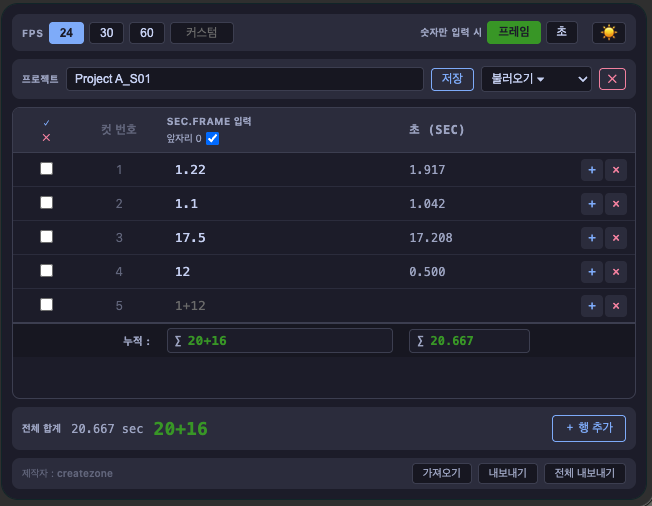

# フレーム計算機 (Frame Calculator)

[한국어](README.md) | [日本語](README.ja.md)

アニメーション制作向けのフレーム/タイムコード計算機 Chrome 拡張機能です。

従来のGoogleスプレッドシートベースのツールで発生していた小数点表記の混乱（`4.70` → 4秒7フレーム？4秒70フレーム？）を解消するために制作しました。

---

## 機能

- **複数の入力形式に対応**: `1+12` / `1.12` / `1 12` をすべて1秒12フレームとしてパース
- **FPS対応**: 24 / 30 / 60 およびカスタムFPS
- **リアルタイム合計**: 選択行または全行の合計を 秒+フレーム / 小数点秒 で表示
- **プロジェクト管理**: 複数プロジェクトを名前別に保存・読み込み
- **Import / Export**: プロジェクトをJSONファイルで書き出し・読み込み
- **自動保存**: Chrome Storage Syncに自動保存（容量超過時はLocalにフォールバック）
- **ダーク / ライトモード** 切り替え

---

## インストール方法

1. このリポジトリをクローンするか、ZIPでダウンロードします。
2. Chromeブラウザで `chrome://extensions` を開きます。
3. 右上の **デベロッパーモード** を有効にします。
4. **パッケージ化されていない拡張機能を読み込む** ボタンをクリックし、`output/` フォルダを選択します。

---

## 入力形式

| 入力 | 意味 |
|------|------|
| `1+12` | 1秒12フレーム |
| `1.12` | 1秒12フレーム |
| `1 12` | 1秒12フレーム |
| `36` | 36フレーム（数字のみモード: フレーム） |
| `36` | 36秒（数字のみモード: 秒） |

---

## 制作者

[createzone](https://jidae.com/)
